# Go + HTMX + Bulma Project

A full-stack web application built with Go, Gin, HTMX, Bulma CSS, and MySQL.

## Project Structure

- `cmd/web/`: Main entrypoint
- `internal/`: Private application domain logic

```mermaid
graph TD
  subgraph Cmd
    C1[cmd/web/main.go] -->|starts| R[internal/http/routes/routes.go]
    C1 -->|loads| CFG[internal/config/config.go]
    C1 -->|sets up| OT[internal/telemetry/telemetry.go]
  end

  subgraph Internal
    subgraph Service
      US[internal/user] --> UR[internal/user/repository.go]
      US --> USvc[internal/user/service.go]
      US --> URemote[internal/user/remote_service.go]

      VS[internal/vehicle] --> VR[internal/vehicle/repository.go]
      VS --> VSvc[internal/vehicle/service.go]
      VS --> VRemote[internal/vehicle/remote_service.go]
    end

    subgraph HTTP
      HWeb[internal/http/handlers/web] -->|Web handlers| HVC[vehicle_color.go]
      HWeb -->|Web handlers| HVM[vehicle_make.go]
      HWeb -->|Web handlers| HUser[user.go]
      HWeb -->|Web handlers| HRole[role.go]
      HWeb -->|Web handlers| HAuth[auth.go]

      HAPI[internal/http/handlers/api] -->|API handlers| API_VC[vehicle_color.go]
      HAPI -->|API handlers| API_VM[vehicle_make.go]
      HAPI -->|API handlers| API_User[user.go]
      HAPI -->|API handlers| API_Role[role.go]
      HAPI -->|API handlers| API_Auth[auth.go]

      Middleware[internal/http/middleware] --> AuthMid[auth.go]
    end

    View[internal/view] --> Renderer[templates renderer]
  end

  subgraph Templates
    TLayouts[templates/layouts] --> Base[base.html]
    TPages[templates/pages] --> VehicleColors[vehicle_colors/index.html]
    TPages --> VehicleMakes[vehicle_makes/index.html]
    TPartials[templates/partials] --> TableRows[vehicle_colors/table_row.html]
    TPartials --> TableRowsMake[vehicle_makes/table_row.html]
  end

  subgraph Static
    CSS[static/css] --> Bulma[Bulma.css]
    JS[static/js] --> HTMX[htmx.js]
    IMG[static/img]
  end

  subgraph DB
    DBUser[User MySQL DB] -->|FMS_USER_DB_DSN| USvc
    DBVeh[Vehicle MySQL DB] -->|VEHICLE_DB_DSN| VSvc
  end

  %% Role wiring (set by APP_ROLE env var)
  C1 -->|APP_ROLE=user-service| USvc
  C1 -->|APP_ROLE=vehicle-service| VSvc
  C1 -->|APP_ROLE=web-view| HWeb & HAPI
```



  - `internal/user/`: Core User, Role, and Auth domain logic (interfaces, local DB implementations, HTTP API clients)
  - `internal/vehicle/`: Core Vehicle (Colors & Makes) domain logic
  - `internal/http/`: Web & REST handlers, middleware, and route registration
  - `internal/view/`: HTML render helpers
  - `internal/config/`: Configuration manager
  - `internal/db/`: Database helpers
- `templates/`: HTML templates (layouts, pages, partials)
- `static/`: Static assets (CSS, JS, images)
- `migrations/`: MySQL schema migrations

## Getting Started

1.  **Prerequisites**: Go 1.26+, MySQL
2.  **Setup Environment**:
    ```bash
    cp .env.example .env
    # Update .env with your MySQL DSN settings and JWT signature key
    ```

3.  **Run the Application (Multi-Role Configuration)**:

    The application is built as a modular monolith and can be run in four distinct roles using the `APP_ROLE` environment variable:

    ### Option A: Monolith Mode (Default)
    Runs all web presentation handlers and API endpoints in-memory, requiring connections to both User and Vehicle MySQL databases.
    ```bash
    go run ./cmd/web
    # Server starts on port 8080 (or PORT in .env)
    ```

    ### Option B: Isolated User Service Mode
    Runs strictly as a headless JSON API server on port `8081`, requiring connection **only** to the user database (`FMS_USER_DB_DSN`).
    ```bash
    APP_ROLE=user-service PORT=8081 go run ./cmd/web
    ```

    ### Option C: Isolated Vehicle Service Mode
    Runs strictly as a headless JSON API server on port `8082`, requiring connection **only** to the vehicle database (`VEHICLE_DB_DSN`).
    ```bash
    APP_ROLE=vehicle-service PORT=8082 go run ./cmd/web
    ```

    ### Option D: Isolated Web/View Mode (Database-Free!)
    Runs as a pure presentation layer serving HTML/HTMX templates on port `8080`. When both backend service URLs are provided, it operates with **zero database connections**, delegating all data queries to remote JSON APIs over HTTP:
    ```bash
    APP_ROLE=web-view PORT=8080 USER_SERVICE_URL="http://localhost:8081" VEHICLE_SERVICE_URL="http://localhost:8082" go run ./cmd/web
    ```


4.  **Generating Password Hashes (for Database Seeding)**:
    To manually insert or update a user in your MySQL database with a compatible hashed password, you can use the built-in test helper:
    - Open `internal/pkg/crypto/password_test.go` and set your desired plain password.
    - Run the generator command:
      ```bash
      go test -v ./internal/pkg/crypto -run TestGenerateHash
      ```
    - Use the printed Base64 hash in your SQL insert or update query.


## Testing & Coverage

Run all tests:
```bash
make test
# or
go test ./...
```

Run tests with a **filtered coverage report** (excludes infrastructure/wiring packages like `cmd/`, `internal/view/`, `internal/config/`, `internal/db/`, `internal/http/routes/`):
```bash
make test-coverage
```

Run tests with the **full coverage report** (all packages):
```bash
go test ./... -coverprofile=coverage.out && go tool cover -func=coverage.out
```

Open the **interactive HTML coverage report** in your browser:
```bash
go test ./... -coverprofile=coverage.out && go tool cover -html=coverage.out
```

Clean up coverage artifacts:
```bash
make clean
```

### Coverage priorities

| Package | Target |
|---|---|
| `internal/user/` | **High (80%+)** (Business logic, REST clients, and DB repositories) |
| `internal/vehicle/` | **High (80%+)** (Business logic and DB repositories) |
| `internal/http/handlers/` | Medium |
| `internal/view/`, `internal/config/`, `internal/db/`, `cmd/` | Skip (infrastructure/wiring) |

## Available Commands

| Command | Description |
|---|---|
| `make run` | Run the application (Monolith mode) |
| `make build` | Compile the binary |
| `make test` | Run all tests |
| `make test-coverage` | Run tests with filtered coverage report |
| `make vet` | Run `go vet` |
| `make lint` | Run `golangci-lint` |
| `make clean` | Remove coverage artifacts |

## UI Tests (Playwright)

End-to-end browser tests live in `test/e2e/` and use [Playwright](https://playwright.dev/).

**Prerequisites:** Node.js 18+, and the app must be running before the tests execute.

### Setup (first time only)

```bash
cd test/e2e
npm install
npx playwright install chromium
```

### Running the tests

Start the app in one terminal:
```bash
go run ./cmd/web
```

Then in another terminal:
```bash
cd test/e2e

# Run all tests headless (CI-style)
npm test

# Run with a visible browser window (useful for debugging)
npm run test:headed

# Open Playwright's interactive UI explorer
npm run test:ui

# View the HTML report from the last run
npm run report
```

### Environment variables

| Variable | Default | Description |
|---|---|---|
| `APP_URL` | `http://localhost:8080` | Base URL of the running app |
| `TEST_EMAIL` | `admin@example.com` | Valid login email for success-path tests |
| `TEST_PASSWORD` | `password` | Valid login password for success-path tests |

```bash
cd test/e2e
APP_URL=http://localhost:8080 TEST_EMAIL=admin@fleet.com TEST_PASSWORD=secret npm test
```

### Test coverage

| File | Tests |
|---|---|
| `tests/login.spec.ts` | Form render, autofocus, empty submit validation, wrong credentials error, email pre-population, dismiss notification, successful redirect, `/` alias |

## Technology Stack

- **Backend**: [Gin](https://github.com/gin-gonic/gin)
- **Frontend**: [HTMX](https://htmx.org/)
- **CSS**: [Bulma](https://bulma.io/)
- **Database**: MySQL
